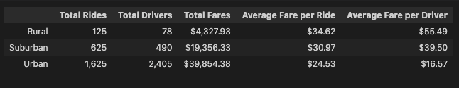
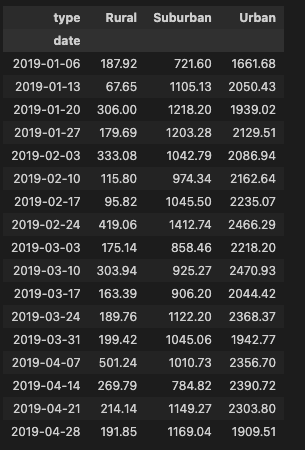
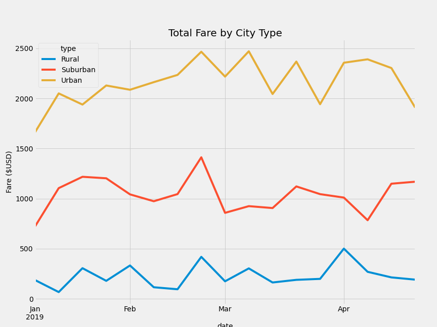

# PyBer Ride Analysis

## Overview of the analysis:

The purpose of the new analysis is to further analyze the ride-sharing data by city type. First, I create a summary DataFrame of the ride-sharing data by city type using the city data and ride data. Then I use Pandas and Matplotlib to create a multiple-line graph that shows the total weekly fares for each city type. In this report, I summarize how the data differs by city type.

## Results:

This section contains a description of the differences in ride-sharing data among the different city types. 

Ride-sharing data include the total rides, total drivers, total fares, average fare per ride and driver, and total fare by city type.

The following table summarizes the ride sharing data from the analysis in table format:

The following table summarizes the analysis of the total fare by city type:

The following chart summarizes the ride sharing data from the analysis in graph format:

By analyzing the data in the above tables and charts, we can make the following observations:

### Total Rides Analysis
Urban cities have the largest share of total rides followed by Suburban cities followed by Rural cities.
- The number of Total Rides in Rural cities is approx. 8% of the Total Rides in Urban cities.  
- The number of Total Rides in Rural cities is approx. 20% of the Total Rides in Suburban cities.
- The number of Total Rides in Suburban cities is approx. 38% of the Total Rides in Urban cities.

### Total Driver Analysis
Urban cities have the largest share of drivers followed by Suburban cities followed by Rural cities.
- The number of Total Drivers in Rural cities is approx. 3% of the Total Drivers in Urban cities.  
- The number of Total Drivers in Rural cities is approx. 16% of the Total Drivers in Suburban cities.
- The number of Total Rides in Suburban cities is approx. 20% of the Total Rides in Urban cities.

### Total Fare Analysis
Urban cities have the largest share of total fare followed by Suburban cities followed by Rural cities.
- The Total Fare in Rural cities is approx. 11% of the Total Fare in Urban cities.  
- The Total Fare in Rural cities is approx. 22% of the Total Fare in Suburban cities.
- The Total Fare in Suburban cities is approx. 49% of the Total Fare in Urban cities.

### Average Fare per Ride Analysis
Rural cities have the highest average fare per ride followed by Suburban cities followed by Urban cities.
- The Average Fare per Ride in Rural cities is approx. 41% higher than Average Fare per Ride in Urban cities.  
- The Average Fare per Ride in Rural cities is approx. 12% higher than Average Fare per Ride in Suburban cities.  
- The Average Fare per Ride in Suburban cities is approx. 26% higher than Average Fare per Ride in Urban cities.

### Average Fare per Driver Analysis
Rural cities have the highest average fare per driver followed by Suburban cities followed by Urban cities.
- The Average Fare per Driver in Rural cities is approx. 335% higher than Average Fare per Driver in Urban cities.  
- The Average Fare per Driver in Rural cities is approx. 40% higher than Average Fare per Driver in Suburban cities.  
- The Average Fare per Driver in Suburban cities is approx. 138% higher than Average Fare per Driver in Urban cities.

### Total Fare By City Type Analysis
Urban cities have the highest total fare followed by Suburban cities followed by Rural cities.
- The weekly total fares for Urban cities range from $1661.68 to $2470.93 during the first 4 months in 2019
- The weekly total fares for Suburban cities range from $721.60 to $1412.74 during the first 4 months in 2019
- The weekly total fares for Rural cities range from $67.65 to $501.24 during the first 4 months in 2019

## Summary:

This section summarizes three business recommendations to the CEO for addressing any disparities among the city types.

1. **Consider Investment in Drivers for Suburban cities**
Suburban cities have a higher fare per ride and fare per driver than Urban cities. The demand in Suburban cities also seems to be consistent to support additional drivers.

2. **Explore ROI for Investment in additional drivers for Urban cities**
Urban cities have the highest Total Fare but fare per ride and fare per driver are the lowest. Further analysis has to be done to see if adding additional drivers in Urban cities further reduces the fare per ride due to the increased supply of drivers.

3. **Conduct further analysis considering driving distance and duration**
Additional data analysis is required to see if the higher fares per ride and higher fares per driver for Rural and Suburban cities correlate to rides that have longer distance or longer duration. 